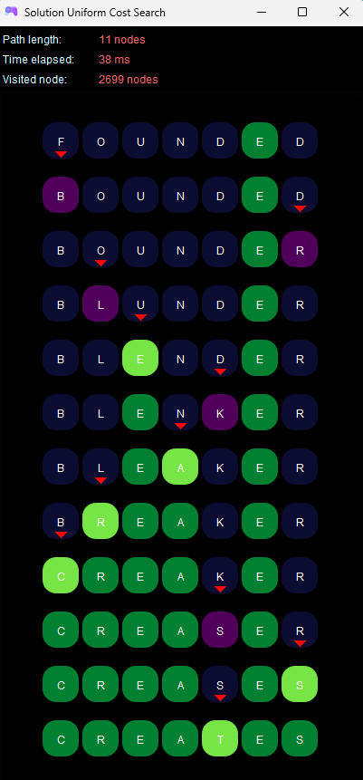

# WORD LADDER - 13522098

## Table of Contents
* [General Info](#general-information)
* [Technologies Used](#technologies-used)
* [Features](#features)
* [Screenshots](#screenshots)
* [How to Use](#setup)
* [Usage](#how-to-use)
* [Project Status](#project-status)
* [Room for Improvement](#room-for-improvement)
* [Acknowledgements](#acknowledgements)
* [Contact](#contact)
<!-- * [License](#license) -->


## General Information
This project is a tool to solve the [_Word Ladder_](https://wordwormdormdork.com/) game problems.
As one of the assignments in the Algorithm Strategy course, this program applies the Uniform Cost Search, Greedy Best First Search, and A star algorithms.


## Technologies Used
- Java 21+
- Java swing library


## Features
This program is made to solve the Word Ladder problems using the algoritms below:
- UCS - Uniform Cost Search
- Greedy BFS
- A* (A Star)


## Screenshots
This is the home dasboard view.

<br>
<p align="center">

</p>
<br>

When you search the solution and it exists this is the view.

<br>
<p align="center">

</p>
<br>

If the solution doesn't exist the display is would be like this.

<br>
<p align="center">

</p>
<br>


## Setup
This program requires
- ```Java 21+```
- ```Java swing library``` 
If you dont have the installed ```Java 21``` version or higher, you need to install it first. 


## How to Use
How does one go about using it?
Provide various use cases and code examples here.

`write-your-code-here`

Go the root directory of this project.
This program is used 


## Project Status
Project is: _in progress_ / _complete_ / _no longer being worked on_. If you are no longer working on it, provide reasons why.


## Room for Improvement
Include areas you believe need improvement / could be improved. Also add TODOs for future development.

Room for improvement:
- Improvement to be done 1
- Improvement to be done 2

To do:
- Feature to be added 1
- Feature to be added 2


## Acknowledgements
Give credit here.
- This project was inspired by...
- This project was based on [this tutorial](https://www.example.com).
- Many thanks to...


## Contact
Created by [@flynerdpl](https://www.flynerd.pl/) - feel free to contact me!


<!-- Optional -->
<!-- ## License -->
<!-- This project is open source and available under the [... License](). -->

<!-- You don't have to include all sections - just the one's relevant to your project -->