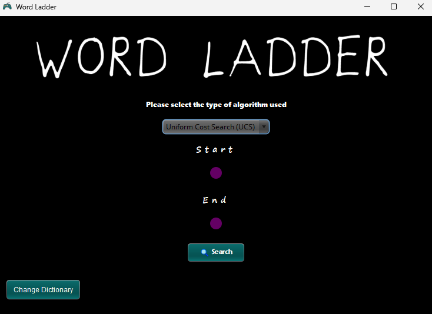
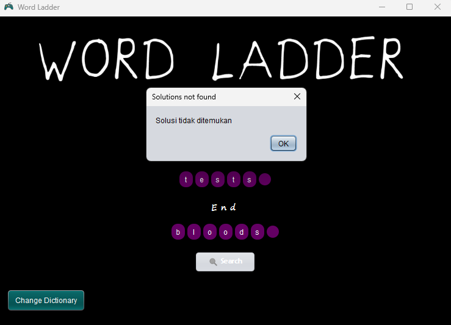

# WORD LADDER - Suthasoma Mahardhika Munthe 13522098

## Table of Contents
* [General Info](#general-information)
* [Technologies Used](#technologies-used)
* [Features](#features)
* [Screenshots](#screenshots)
* [How to Use](#setup)
* [Usage](#how-to-use)
* [Acknowledgements](#acknowledgements)
<!-- * [License](#license) -->


## General Information
This project is a tool to solve the [_Word Ladder_](https://wordwormdormdork.com/) game problems.
As one of the assignments in the Algorithm Strategy course, this program applies the Uniform Cost Search, Greedy Best First Search, and A star algorithms.


## Technologies Used
- Java 21+
- Java swing library


## Features
This program is made to solve the Word Ladder problems using the algoritms below:
- UCS (Uniform Cost Search)
- Greedy BFS (Best First Search)
- A* (A Star)


## Screenshots
This is the home dasboard view.

<br>
<p align="center">

</p>
<br>

When you search the solution and it exists this is the view.

<br>
<p align="center">

</p>
<br>

If the solution doesn't exist the display is would be like this.

<br>
<p align="center">

</p>
<br>

> You can change the dictionary for checking the validity with your expected solutions using the button ```Change Dictionary``` on the bottom left corner.


## Setup
This program requires
- ```Java 21+```
- ```Java swing library``` 
If you dont have the installed ```Java 21``` version or higher on your device, you need to install it first. 


## How to Use

Go the root directory of this project.
This program will use the `jar` file.

So, make sure you are in the correct root directory of this project.

Because some file is relatively read and the program may abort if the relative working directory isn't in the required path.

> Please do not edit the code in the src directory without using the Netbeans Apache IDE. Class files may be violated.

To run this program use this command in your terminal

Command Prompt Windows
```
run.bat
```
Windows Powershell
```
./run.bat
```
Linux
```
./run.sh
```
Another alternative to run this program is using command below
```
java -jar dist/WordLadder.jar
```

## Acknowledgements
- This project was inspired by the IRK Assistant
- This project was based on [this module](https://informatika.stei.itb.ac.id/~rinaldi.munir/Stmik/2020-2021/Route-Planning-Bagian1-2021.pdf).
